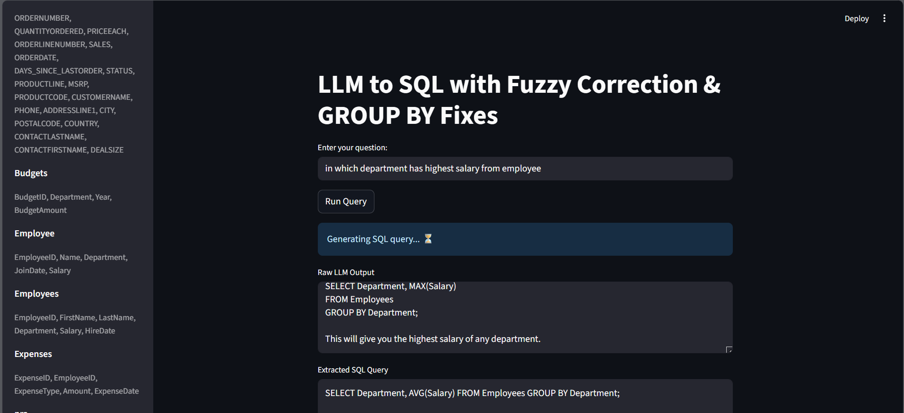

# LLM to SQL App



# LLM to SQL with Fuzzy Correction & GROUP BY Fixes

 

A **Streamlit web application** that converts natural language questions into SQL queries using a **Large Language Model (LLM)**. The app automatically cleans and corrects SQL, performs fuzzy table/column matching, and fixes common SQL Server `GROUP BY` issues.

---

## Features

* Generate SQL queries from natural language questions.
* Auto-extract SQL from LLM outputs.
* Fuzzy correction for **table and column names**.
* Fixes common SQL Server issues:

  * TOP clauses
  * Bracket imbalances
  * `GROUP BY` and `ORDER BY` errors
* Displays query results in an interactive Streamlit table.
* Shows database schema in the sidebar.
* Includes a test query section for debugging.

---

## Demo

**Main Panel:**

* Text input for natural language queries.
* Displays:

  * Raw LLM output
  * Extracted SQL
  * Corrected SQL
  * Query results

**Sidebar:**

* Database schema visualization.
* Test query example for debugging.

---

## Installation

1. Clone the repository:

```bash
git clone https://github.com/yourusername/llm-to-sql.git
cd llm-to-sql
```

2. Install dependencies:

```bash
pip install -r requirements.txt
```

> **Dependencies**: `streamlit`, `pandas`, `sqlalchemy`, `pyodbc`, `langchain_ollama`, `langchain_community`.

3. Ensure **ODBC Driver 17 for SQL Server** is installed on your system.

---

## Configuration

Update the database connection settings in the script:

```python
server = "YOUR_SERVER_NAME"
database = "YOUR_DATABASE_NAME"

connection_string = (
    f"mssql+pyodbc://@{server}/{database}"
    "?driver=ODBC+Driver+17+for+SQL+Server&trusted_connection=yes"
)
```

---

## Usage

Run the Streamlit app:

```bash
streamlit run app.py
```

1. Enter a natural language query (e.g., *"Show me the 10 orders with the highest sales amounts"*).
2. Click **Run Query**.
3. View:

   * Raw LLM output
   * Extracted SQL
   * Corrected SQL
   * Query results table

---

## Helper Functions

* `safe_wrap(name)`: Wraps table/column names with brackets `[]`.
* `closest_match(name, choices)`: Fuzzy matches names to schema.
* `clean_sql_extraction(raw_output)`: Extracts SQL from LLM output.
* `fix_table_names(sql_query, schema_info)`: Corrects table names.
* `fix_column_names(sql_query, schema_info)`: Corrects column names.
* `fix_top_clause_parsing(sql_query)`: Fixes TOP clauses.
* `auto_correct_sql(sql_query, schema_info)`: Runs multiple auto-corrections.
* `fix_group_by(sql_query)`: Adds missing `GROUP BY` when aggregates are used.
* `clean_sql(sql_query, schema_info)`: Combines all cleaning steps.

---

## Test Example

```sql
SELECT TOP 1 ORDERDATE, SALES 
FROM Autod
WHERE DAYS_SINCE_LASTORDER = (SELECT MAX(DAYS_SINCE_LASTORDER) FROM Autod)
```

The app will auto-correct table names and ensure SQL Server compatibility.

---

## Notes

* Requires read permissions on the database.
* Fuzzy matching threshold is high (`0.8`) to prevent incorrect corrections.
* Handles SQL Server-specific issues like bracketed identifiers and TOP clauses.

---

## License

MIT License © 2025 \[Navya]

